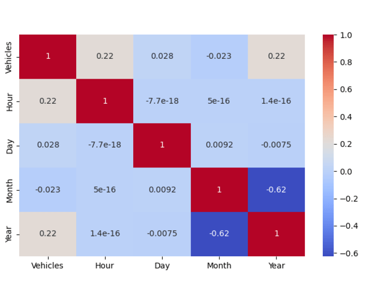

# Traffic_Analysis_project
Traffic Data Exploratory Data Analysis (EDA) project using Python, Pandas, Matplotlib, and Seaborn to analyze traffic patterns, peak hours, weekend trends, and junction-wise congestion behavior.
# Traffic Data Analysis using Exploratory Data Analysis (EDA)

## Project Overview
This project focuses on performing Exploratory Data Analysis (EDA) on a traffic dataset to understand traffic behavior across different time periods and junctions. The analysis identifies traffic patterns, rush hours, weekend trends, and junction-wise congestion using statistical analysis and visualizations.

The project uses Python libraries such as Pandas, Matplotlib, and Seaborn for data cleaning, feature engineering, and visualization.

## Project Demo


---

## Project Structure

```text
Traffic-EDA/
│
├── data/
│   └── traffic.csv
│
├── notebook/
│   └── TrafficEDA_Final.ipynb
│
├── images/
│   ├── traffic_pattern.png
│   ├── heatmap.png
│   ├── junction_analysis.png
│   └── demo.gif
│
└── README.md


```
## Dataset Features
  DateTime ,  Junction  ,  Vehicles   ,  ID
## Engineered Features
  Hour, Day, Month, Year, Weekday, Is_Weekend, Date, Time
## Objectives
  Analyze traffic flow patterns
  Identify peak traffic hours
  Compare weekday and weekend traffic
  Analyze junction-wise congestion
  Perform univariate, bivariate, and multivariate analysis
## Exploratory Data Analysis
#### Univariate Analysis
  Vehicle distribution
  Junction analysis
  Hourly traffic trends
  Monthly and yearly distribution
#### Bivariate Analysis
  Vehicles vs Hour
  Vehicles vs Weekday
  Vehicles vs Junction
  Vehicles vs Weekend
#### Multivariate Analysis
  Correlation Heatmap
  Hour vs Vehicles by Junction
  Traffic trends across weekdays and weekends
## Hypotheses Tested
#### H1: Time-based Traffic Pattern
  Traffic volume shows clear morning and evening rush hour peaks.
#### H2: Weekday vs Weekend Difference
  Weekend traffic patterns are smoother compared to weekdays.
#### H3: Junction-wise Traffic Difference
  Some junctions consistently experience higher traffic volume.
## Key Insights
  Traffic follows a bi-modal pattern with morning and evening peaks.
  Weekdays experience heavier traffic than weekends.
  Some junctions act as major congestion points.
  Traffic behavior changes significantly across time and location.
## Technologies Used
  Python, Pandas, NumPy, Matplotlib, Seaborn, Jupyter Notebook
## Business Insights
  Peak-hour traffic causes higher congestion during morning and evening hours.
  Weekdays experience heavier traffic compared to weekends.
  Some junctions act as major traffic bottlenecks.
  Traffic analysis can help improve road planning and signal management.
## Conclusion
  The analysis reveals that traffic behavior is strongly influenced by both temporal and spatial factors. Peak-hour congestion, weekday     traffic intensity, and junction-wise traffic variation highlight important urban traffic patterns useful for traffic management and       planning.
## Author
#### Linkedin Profile : www.linkedin.com/in/kavita-bisht-17345b3a6
#### Kavita Bisht
